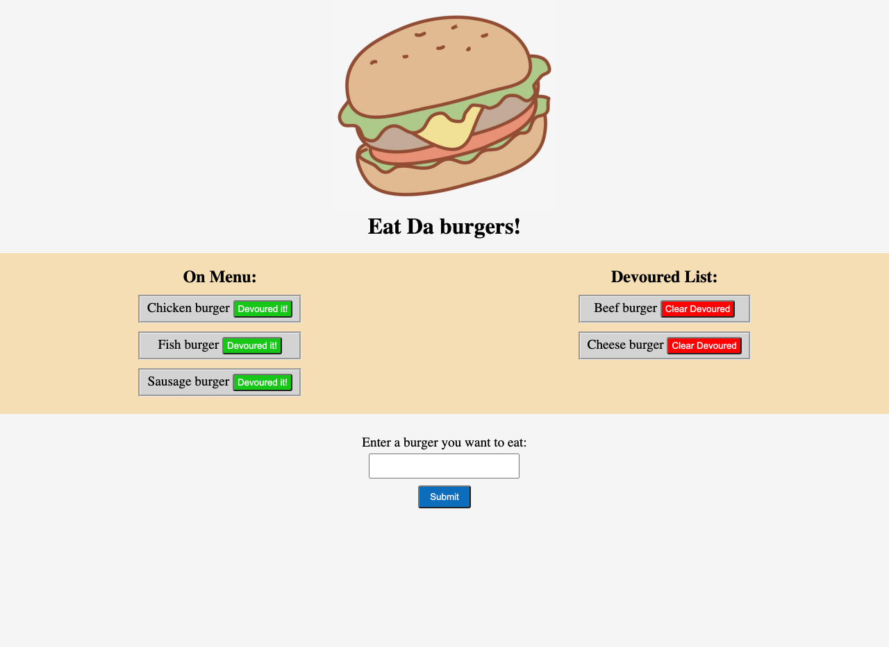

# Eat-Da-Burger

## Task

The purpose of this assignment is to follow MVC design pattern to create an application called burger logger which is for users to record their burgers menu. This application will allow users to input what burgers they would like to eat and sort the list of burgers they have devoured. Various npm packages included Node, Express, and MySQL which are used to handle application routes and database, and handlebars is used to generate the HTML webpage.

## Technologies Used

* CSS
* JQuery
* JavaScript
* Node.js
* Express - npm
* MySQL - npm
* Handlebars - npm

## Appearance and Functionality

Below is the appearance of page of the application:

Here is the deployed link of the application: [Eat Da Burger!](https://sleepy-sea-64053.herokuapp.com/)

You can also explore this application through my [portfolio](https://ywen26.github.io/Personal-Portfolio/).

## URL Sources

Feel free to check the application repository: [https://github.com/ywen26/Eat-Da-Burger](https://github.com/ywen26/Eat-Da-Burger)

If you have any questions and ideas about this application, please contact me at: <yensonyu@gmail.com>

## License

MIT License

Copyright (c) [2021] [Ywuen Yu]

Permission is hereby granted, free of charge, to any person obtaining a copy of this software and associated documentation files (the "Software"), to deal in the Software without restriction, including without limitation the rights to use, copy, modify, merge, publish, distribute, sublicense, and/or sell copies of the Software, and to permit persons to whom the Software is furnished to do so, subject to the following conditions:

The above copyright notice and this permission notice shall be included in all copies or substantial portions of the Software.

THE SOFTWARE IS PROVIDED "AS IS", WITHOUT WARRANTY OF ANY KIND, EXPRESS OR IMPLIED, INCLUDING BUT NOT LIMITED TO THE WARRANTIES OF MERCHANTABILITY, FITNESS FOR A PARTICULAR PURPOSE AND NONINFRINGEMENT. IN NO EVENT SHALL THE AUTHORS OR COPYRIGHT HOLDERS BE LIABLE FOR ANY CLAIM, DAMAGES OR OTHER LIABILITY, WHETHER IN AN ACTION OF CONTRACT, TORT OR OTHERWISE, ARISING FROM, OUT OF OR IN CONNECTION WITH THE SOFTWARE OR THE USE OR OTHER DEALINGS IN THE SOFTWARE.

